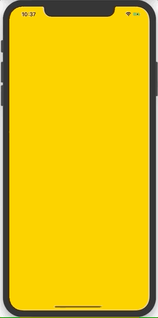
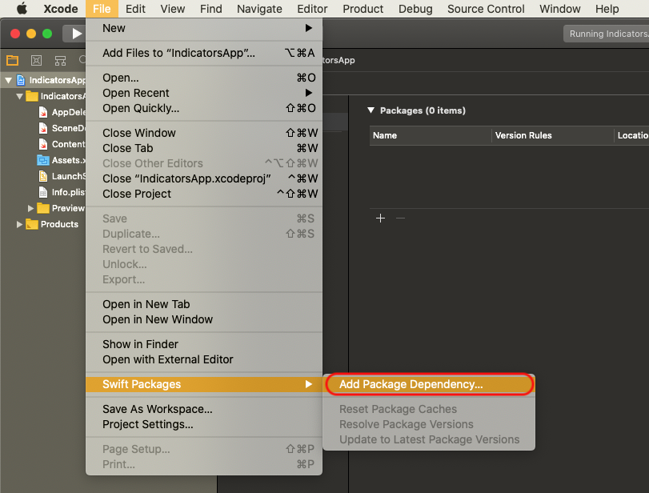
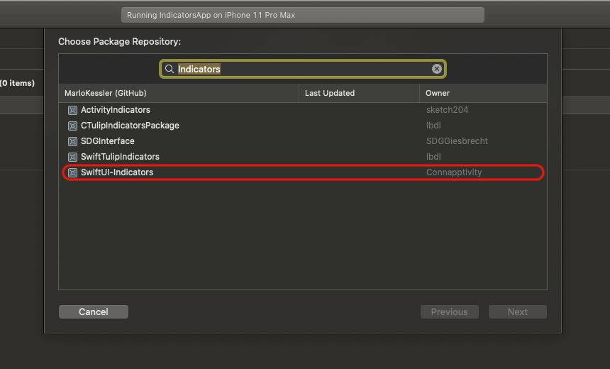
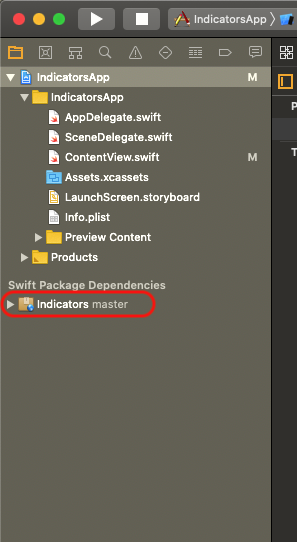
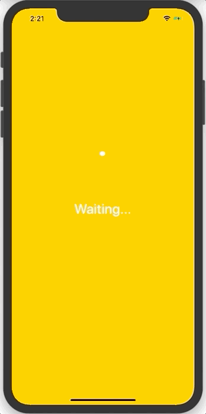
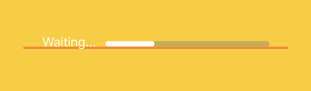

# Indicators

This package contains a bundle of Indicators purely written in SwiftUI. Feel free to fork and add your code. 




## Getting Started

To get started, add the package dependency via the Swift package manager. Therefore, open your project in Xcode. In the menu select _File>Swift Packages>Add Dependency_.



Then search for _Indicators_ and choose _SwiftUI-Indicators_ from Connapptivity. 



Now choose the version you want to add and the target and click _Finish_ to import the package. Finally you should see it in the project navigator under Swift Pakckage Dependencies.



For using Indicators in your code just add the `import Indicators` statement at the top of your swift code file.


## General

### Indicator Types

This package contains six indicator types and seven different indicators. Available indicators are

Success indicators:
```swift
SuccessIndcator()
```

Failure indicators:
```swift
FailureIndcator()
```

Info indicators:
```swift
InfoIndcator()
```

Waiting Indcators:
```swift
CircularWaitingIndcator()

LinearWaitingIndcator()
```
    
Progress indcators:
```swift
CircularProgressIndcator()

LinearProgressIndcator()
```

### Customization

Every indicator can be customized in several ways:

```swift
Indicator()

// Set a custom foregroundcolor.
.foregoundColor(Color?)

// Set a custom linewidth.
.lineWidth(Double)

// Set the animation pace of the indicator.
.pace(Double)

// Set if indicator changes should be animated. The default value is true.
.animated(Bool = true)

// Set your custom animation to the indicator
.animation(Animation?)
```

The waiting and progress indicators can be additionally customized. To check out these options have a look at the documentation below.

## Show Text with Waiting and Progress Indicators

You have the possibility to show text with waiting and progress indicators. The text can be declared directly in the initializer:

```swift
WaitingIndicator(Double, text: String?)

ProgressIndicator(Double, text: String?)
```

With circular indicators the text resizes automatically according to the size of the indicator. The indicator always trys to show the whole text and prevent coverage. 



With linear indicators the text does not resize automatically. Here you can adjust the font according to your needs.

```swift
LinearIndicator()
    .font(Font?)
```
The indicators bottom is aligned to the text base, so the design looks always good.




## Change the Background with Progress Indicators

To give users a intuitive feeling of how much a process is progressed in relation to the whole, progress indicators have a background. You can change the backgroundcolor or set it to clear, if you do not want a colored background.

```swift
ProgressIndicator()
    .backgroundColor(Color?)
```
